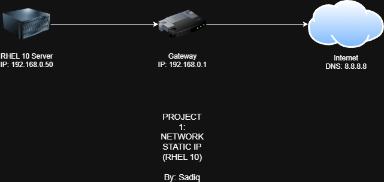
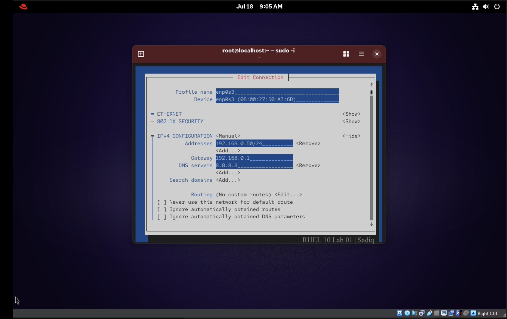
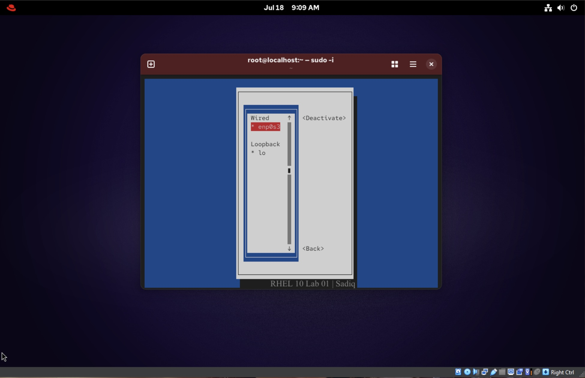
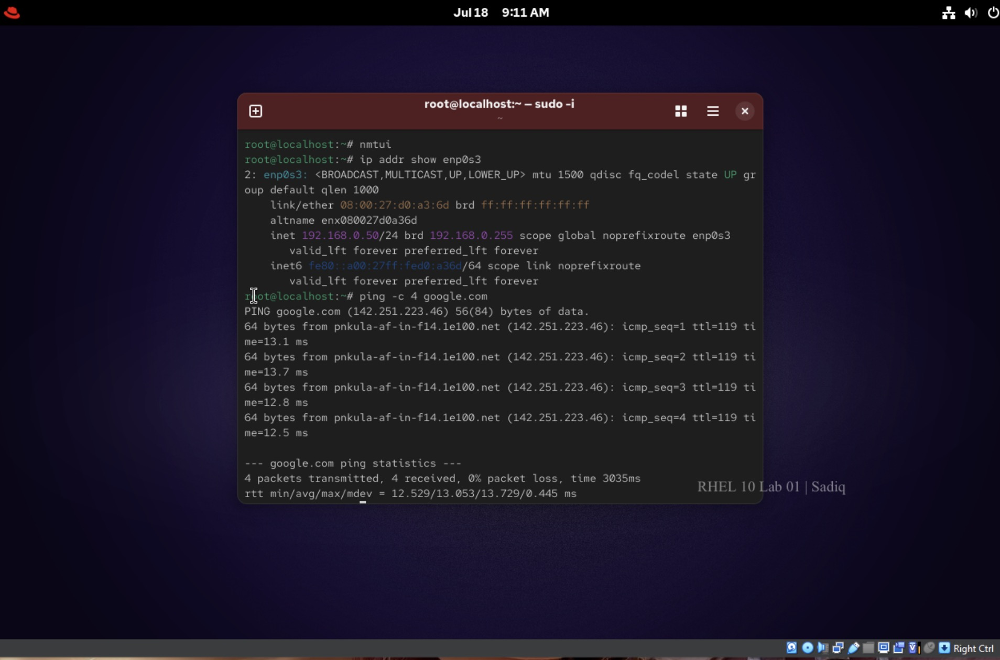

# 🛡️ Project 01: RHEL 10 Network Static IP Configuration

## 📌 The Big Why
In a server environment, relying on DHCP (Dynamic Host Configuration Protocol) is risky because the IP address can change after a reboot. Setting a **Static IP** ensures the server maintains a consistent address, which is critical for remote access (SSH), hosting services, and reliable communication within the network. This project demonstrates configuring a static IP using `nmtui` in Red Hat Enterprise Linux 10.

## 🏗️ Logical Architecture Flow
Below is the network topology mapping the RHEL 10 server to the internet gateway.

## 🛠️ Core Commands Used
*   `sudo nmtui` - Network Manager Text User Interface to configure the IP graphically in CLI.
*   `ip addr show enp0s3` - To confirm the static IP address successfully applied to the interface.
*   `ping -c 4 google.com` - To verify external routing and DNS resolution.

## 📸 Verification & Proof of Concept

### 1. NMTUI Configuration

### 2. Network Activation

### 3. Ping Success

## ⚠️ Troubleshooting Risk & Lessons Learned
**Subnet Mismatch:** During the initial setup, a routing failure occurred because the server IP (`192.168.1.50/24`) and the Gateway (`192.168.0.1`) were on different subnets. 
*   **Resolution:** Modified the server IP to `192.168.0.50/24` to match the Gateway's `0` subnet block, instantly resolving the external routing issue.
